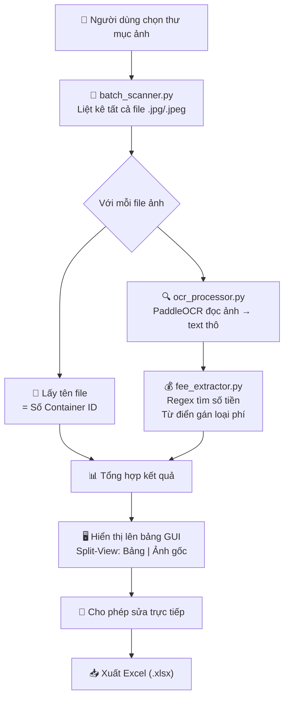

# 📐 KIẾN TRÚC TỔNG QUAN – SmartICDST_OCR v2.0

> **Phiên bản:** 2.0 | **Ngày lập:** 04/06/2026  
> **Mục tiêu:** Ứng dụng Desktop Windows (.exe) chạy OFFLINE để đối soát hóa đơn logistics tự động.

---

## 1. Tóm tắt Kiến trúc Thuật toán

Ứng dụng hoạt động theo pipeline **3 bước** hoàn toàn offline, **KHÔNG sử dụng GenAI/LLM**:

```
┌──────────────┐     ┌──────────────────┐     ┌─────────────────────┐     ┌──────────┐
│  Thư mục ảnh │────▶│ Lấy tên file làm │────▶│ PaddleOCR đọc ảnh   │────▶│ Regex +  │
│  (.jpg)      │     │ SỐ CONTAINER     │     │ → văn bản thô       │     │ Từ điển  │
└──────────────┘     └──────────────────┘     └─────────────────────┘     │ lọc tiền │
                                                                          └────┬─────┘
                                                                               │
                                                      ┌───────────────────────┘
                                                      ▼
                                              ┌──────────────────┐
                                              │ Bảng kết quả:    │
                                              │ Cont | Loại | $  │
                                              │ → Xuất Excel     │
                                              └──────────────────┘
```

### Nguyên tắc cốt lõi:

| # | Nguyên tắc | Mô tả |
|---|-----------|-------|
| 1 | **Số Container = Tên file** | `WHSU6940626.jpg` → Container ID = `WHSU6940626`. Tuyệt đối KHÔNG dùng OCR đọc số cont để tránh sai sót. |
| 2 | **OCR chỉ để đọc nội dung** | PaddleOCR (tiếng Việt, offline) chuyển ảnh thành chuỗi text thô. |
| 3 | **Regex trích xuất số tiền** | Tìm tất cả chuỗi có format `X.XXX.XXX` hoặc `X,XXX,XXX` (VD: `1.014.000`, `882.000`). |
| 4 | **Từ điển gán loại chi phí** | So khớp text OCR với bộ từ khóa: "Hạ bãi", "Nâng rỗng", "Phụ phí",... để xác định loại phí. |

---

## 2. Sơ đồ Kiến trúc Module

```
SmartICDST_OCR/
│
├── core/                          # Logic nghiệp vụ
│   ├── __init__.py
│   ├── ocr_processor.py           # Gọi PaddleOCR, trả về text thô
│   ├── fee_extractor.py           # Regex + Từ điển trích xuất chi phí
│   └── batch_scanner.py           # Quét thư mục, tổng hợp kết quả
│
├── gui/                           # Giao diện người dùng
│   ├── __init__.py
│   ├── app.py                     # Cửa sổ chính Split-View
│   └── components.py              # Widget phụ trợ (bảng, khung ảnh)
│
├── config/                        # Cấu hình
│   └── fee_keywords.py            # Từ điển từ khóa chi phí
│
├── main.py                        # Entry point
├── requirements.txt               # Danh sách thư viện
└── SmartICDST_OCR.spec            # Cấu hình PyInstaller
```

---

## 3. Tech Stack

| Thành phần | Thư viện | Phiên bản | Vai trò |
|-----------|---------|-----------|---------|
| OCR Engine | PaddleOCR | >= 2.9 | Nhận diện chữ tiếng Việt offline |
| Regex | `re` (built-in) | - | Trích xuất số tiền |
| GUI Framework | CustomTkinter | >= 5.2 | Giao diện Desktop hiện đại |
| Xử lý ảnh | Pillow (PIL) | >= 10.0 | Hiển thị ảnh trên GUI |
| Xuất Excel | Pandas + openpyxl | >= 2.2 | Ghi file .xlsx |
| Đóng gói | PyInstaller | >= 6.0 | Build file .exe |

---

## 4. Luồng xử lý chi tiết (Data Flow)



---

## 5. Lộ trình phát triển 4 Sprints

| Sprint | Nội dung | File tạo/sửa |
|--------|---------|---------------|
| **Sprint 1** | Logic cốt lõi: OCR + Regex + Từ điển | `core/ocr_processor.py`, `core/fee_extractor.py`, `config/fee_keywords.py` |
| **Sprint 2** | Giao diện Split-View | `gui/app.py`, `gui/components.py` |
| **Sprint 3** | Tích hợp logic ↔ GUI, Xuất Excel | `core/batch_scanner.py`, cập nhật `gui/app.py` |
| **Sprint 4** | Đóng gói .exe | `SmartICDST_OCR.spec`, `main.py` |
