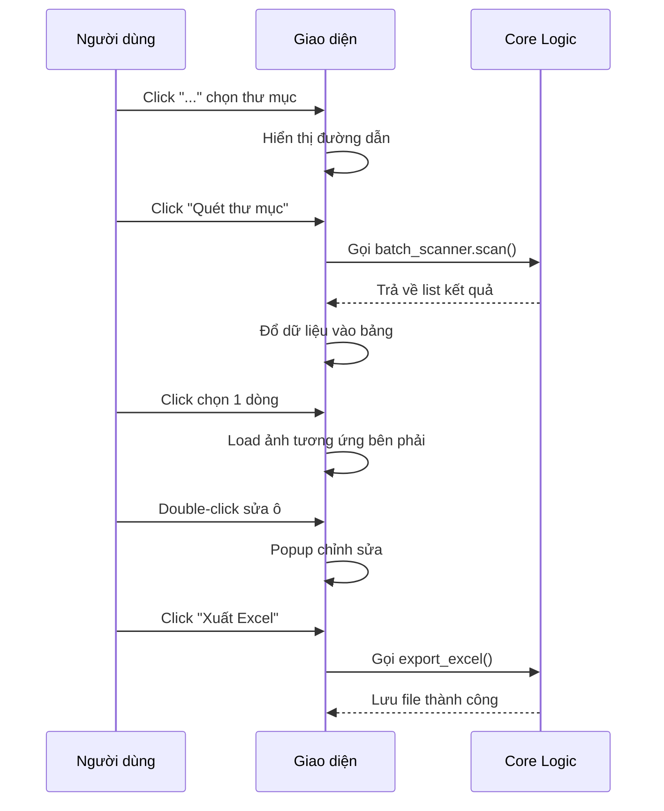

# 🖥️ SPRINT 2 – ĐẶC TẢ KỸ THUẬT: GIAO DIỆN SPLIT-VIEW

> **Ngày lập:** 04/06/2026  
> **Mục tiêu Sprint:** Thiết kế giao diện CustomTkinter dạng Split-View hoàn chỉnh.

---

## 1. Bố cục giao diện (Layout)

```
┌──────────────────────────────────────────────────────────────────┐
│  SmartICDST_OCR v2.0 – Đối Soát Hóa Đơn Logistics             │
├────────────────────────────────┬─────────────────────────────────┤
│  📂 Thư mục: [___________][…] │                                 │
├────────────────────────────────┤                                 │
│  Bảng kết quả (Treeview)       │   🖼️ Ảnh gốc hóa đơn          │
│  ┌────────┬──────────┬───────┐ │   (Hiển thị ảnh container      │
│  │ Số Cont│ Loại phí │Số tiền│ │    đang được chọn trong bảng)  │
│  ├────────┼──────────┼───────┤ │                                 │
│  │ BEAU...│ Nâng     │1.014k │ │                                 │
│  │ BEAU...│ Hạ bãi   │  882k │ │                                 │
│  │ BMOU...│ Vệ sinh  │  500k │ │                                 │
│  │        │          │       │ │                                 │
│  │        │          │       │ │                                 │
│  └────────┴──────────┴───────┘ │                                 │
├────────────────────────────────┼─────────────────────────────────┤
│  [🔍 Quét thư mục]  [📥 Xuất Excel]  [⚙️ Cài đặt]             │
└──────────────────────────────────────────────────────────────────┘
```

---

## 2. Thành phần giao diện chi tiết

### 2.1. Thanh Toolbar (trên cùng)

| Widget | Kiểu | Chức năng |
|--------|------|-----------|
| Label "Thư mục:" | `CTkLabel` | Nhãn chỉ dẫn |
| Entry path | `CTkEntry` | Hiển thị đường dẫn thư mục đã chọn |
| Nút "..." | `CTkButton` | Mở dialog chọn thư mục (`filedialog.askdirectory`) |

### 2.2. Panel trái – Bảng kết quả (60% width)

| Thuộc tính | Giá trị |
|-----------|---------|
| Widget | `ttk.Treeview` (được style hóa) |
| Cột 1 | **Số Container** (width ~150px) |
| Cột 2 | **Loại chi phí** (width ~150px) |
| Cột 3 | **Số tiền** (width ~120px, căn phải) |
| Sự kiện | Click chọn dòng → hiển thị ảnh tương ứng bên phải |
| Double-click | Mở popup chỉnh sửa giá trị ô được chọn |

### 2.3. Panel phải – Hiển thị ảnh (40% width)

| Thuộc tính | Giá trị |
|-----------|---------|
| Widget | `CTkLabel` chứa `CTkImage` |
| Tính năng | Auto-resize ảnh vừa khung |
| Mặc định | Hiển thị text "Chọn dòng trong bảng để xem ảnh" |

### 2.4. Thanh Action Bar (dưới cùng)

| Nút | Chức năng |
|-----|-----------|
| 🔍 Quét thư mục | Trigger quá trình OCR + phân tích toàn bộ |
| 📥 Xuất Excel | Lưu bảng kết quả thành file .xlsx |

---

## 3. Tương tác người dùng (UX Flow)



---

## 4. Theme & Styling

| Thuộc tính | Giá trị |
|-----------|---------|
| Appearance Mode | `System` (auto dark/light) |
| Color Theme | `blue` |
| Font chính | Segoe UI, 12px |
| Font bảng | Consolas, 11px (monospace cho số liệu) |
| Kích thước cửa sổ | 1200 x 700 (mặc định) |
| Min size | 900 x 500 |
